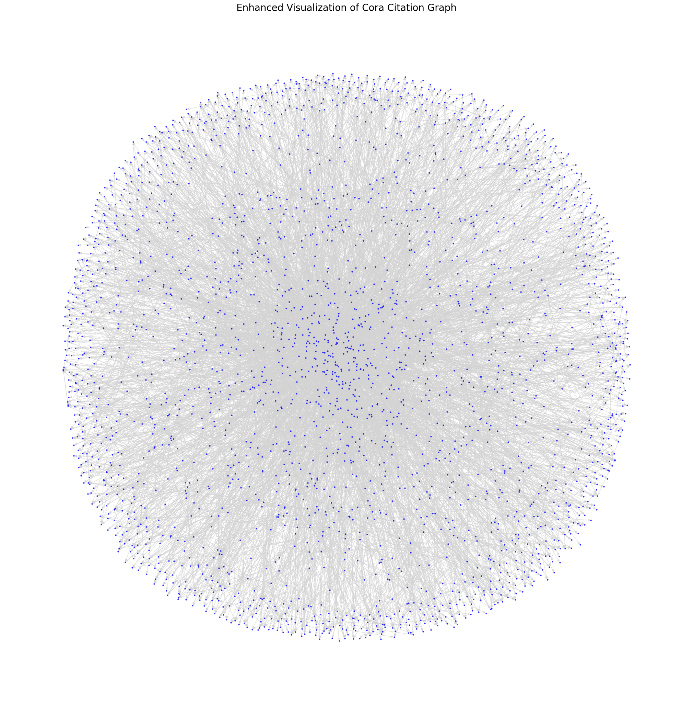

# Node Classification on Cora Dataset using Node Embeddings, GAT, and RGNN

This repository explores **node classification** on the **Cora citation graph** using **Node Embeddings (Node2Vec)**, **Graph Attention Networks (GAT)**, and **Recurrent Graph Neural Networks (RGNN)**. The project includes data preprocessing, graph analysis, visualization, and advanced graph neural network techniques.

---

## 📁 Dataset
The dataset used is the **Cora citation graph**:
- **Nodes**: Represent papers.
- **Edges**: Represent citation links between papers.
- **Features**: Bag-of-words representation of each paper.
- **Labels**: Categories to which each paper belongs.

---

## 🔍 Tasks
1. **Graph Analysis**:
   - Compute graph centrality measures: Degree, Closeness, Betweenness, and Eigenvector centralities.
   - Visualize the graph using a spring layout.

2. **Node Embedding Generation**:
   - Generate node embeddings using **Node2Vec** for structural representation.
   - Parameters optimized for the Cora dataset.

3. **Node Classification with GNNs**:
   - **Graph Attention Networks (GAT)**:
     - Utilizes attention mechanisms for selective aggregation of neighbor features.
     - Includes multi-head attention and residual connections.
   - **Recurrent Graph Neural Networks (RGNN)**:
     - Implements multi-step recurrent updates with GRU cells.
     - Focuses on iterative message passing and aggregation.

---

## 🛠️ Methods and Models
### 1. **Node Embeddings**
   - **Node2Vec** is used to generate node embeddings by simulating random walks and learning structural representations.

### 2. **Graph Neural Networks**
   - **GAT**:
     - Multi-head attention for neighbor aggregation.
     - Residual connections to preserve initial node information.
   - **RGNN**:
     - Single-layer recurrent GNN with GRU-based updates.
     - Multi-step message passing for iterative aggregation.

---

## 📈 Results
- **Test Accuracy**:
  - **GAT**: Achieved high performance with attention-based aggregation.
  - **RGNN**: Used recurrent updates for deeper message propagation.
- **Node Embeddings**: Provided a robust feature set for classification.

---

## 📊 Visualizations
- **Graph Structure**:
  

- **Centrality Measures**:
  Degree, closeness, betweenness, and eigenvector centralities are computed and displayed for the top 5 nodes.

---

## 🛠️ Requirements
- Python 3.8+
- Libraries:
  - `torch`, `torch-geometric`
  - `node2vec`
  - `networkx`
  - `matplotlib`

---

## 📝 License
This project is licensed under the MIT License. See the [LICENSE](LICENSE) file for details.
